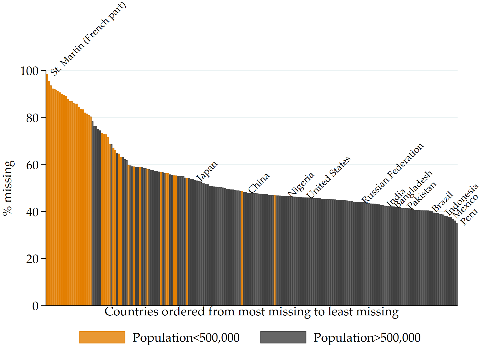

```{r setup, include=FALSE}
options(htmltools.dir.version = FALSE)
library("knitr")
library("xaringanthemer")
library("here")
library("data.table")
library("fontawesome") # from devtools::install_github("rstudio/fontawesome")

knitr::opts_chunk$set(
  warning = FALSE,
  collapse = TRUE,
  message = FALSE,
  # echo = FALSE,
  fig.retina = 3,
  fig.width = 10
)

xaringanExtra::use_xaringan_extra(c("tile_view", "animate_css", "tachyons"))
xaringanExtra::use_webcam()
xaringanExtra::use_clipboard()
htmltools::tagList(
  xaringanExtra::use_clipboard(
    success_text = "<i class=\"fa fa-check\" style=\"color: #90BE6D\"></i>",
    error_text = "<i class=\"fa fa-times-circle\" style=\"color: #F94144\"></i>"
  ),
  rmarkdown::html_dependency_font_awesome()
)
xaringanExtra::use_extra_styles(
  hover_code_line = TRUE,         #<<
  mute_unhighlighted_code = TRUE  #<<
)
xaringanExtra::use_scribble()

```

```{r xaringan-themer, include=FALSE, warning=FALSE}
# style_mono_accent_inverse(base_color = "#002b36")
style_mono_light(
  base_color = "#23395b",
  background_color = "#ffffff"
  # primary_color = "#263341", 
  # secondary_color = "#EDECDA", 
  # text_color = "#EDECDA",
  # header_font_google = google_font("Montserrat", "700"),
  # text_font_google   = google_font("Lato", "500", "500i"),
  # code_font_google   = google_font("IBM Plex Mono")
)
```

name: title
class: left, middle, inverse
background-image: url(img/background1.jpg)
background-size: cover

# To Aggregate Or Not To Aggregate?

.large[Daniel Gerszon Mahler | Umar Serajuddin | `r Sys.Date()`]

<!-- this ends up being the title slide since seal = FALSE-->
---

## When to aggregate?

- Almost all indicators in WDI and among the  SDG have some missingness 

- This generates a trade-off between accuracy and availability

--

  - If regional/global aggregates are shown, they might be inaccurate

  - If aggregates are not shown, there will be less data available the user

<p align="center">

</p>

- How can this trade-off be navigated?

---
## Current rules
WDI rules:

- Most frequent rule: Aggregate when data are available for 2/3s of the relevant population.
- Exceptions pertain to certain indicators

SDG rules:
--
<p align="center">

</p>


---
## Assessing the impact of missingness on accuracy

1. Take indicators with almost no missingness

2. Randomly remove data points

3. Calculate global aggregate

4. Calculate difference from true global aggregate

--
<p align="center">


</p>

---
## Example: GDP per capita growth rates

<p align="center">

</p>

---
## Example: GDP per capita growth rates

<p align="center">

</p>

---
## Averaging over 100 indicators

<p align="center">

</p>

---
## Missing data by country

<p align="center">

</p>

---
## Using empirical missingness draws

<p align="center">

</p>

---
## Using empirical missingness draws

<p align="center">

</p>
--
$$Error = 0.0037*sharemissing$$

---
## Bonus slide

<p align="center">

</p>